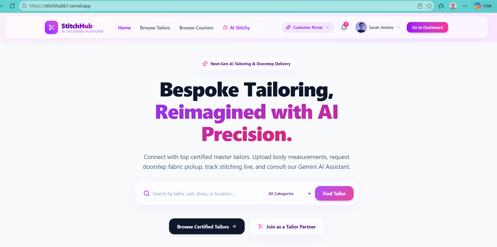

# 🪡 StitchHub — AI-Powered Custom Tailoring & Doorstep Logistics Platform

[](https://stitchhubb1.vercel.app/)
[](https://react.dev/)
[](https://www.typescriptlang.org/)
[](https://tailwindcss.com/)
[](https://ai.google.dev/)

---

## 🌟 Executive Summary & Problem Solved

**StitchHub** is an all-in-one digital marketplace and doorstep logistics ecosystem that connects customers with local master tailors and freelance courier partners.

### 💡 The Vision Behind StitchHub
In traditional markets, thousands of exceptionally skilled local tailors remain limited to serving only their immediate neighborhood or word-of-mouth acquaintances. Their artistic craftsmanship and stitching skills often go underutilized simply due to a lack of digital reach and infrastructure.

StitchHub was conceived with a clear vision:
1. **Empowering Local Artisans:** Providing local master tailors with a dedicated digital storefront, portfolio showcase, transparent pricing list, and customer rating system — allowing them to build a thriving business beyond geographical constraints.
2. **Flexible Earning Opportunities for Courier Partners:** Integrating a dedicated doorstep logistics fleet where students and bike owners can earn part-time income as courier partners by handling fabric pickups and garment deliveries without needing heavy initial capital investment.
3. **Digitalizing Bespoke Fashion:** Bringing convenience to customers by allowing them to save digital measurement profiles, receive doorstep fabric collection, track stitching progress in real-time across 7 distinct stages, and consult an AI fashion assistant.

---

## 🚀 Live Application URL

🔗 **Click to Experience Live:** [https://stitchhubb1.vercel.app/](https://stitchhubb1.vercel.app/)

---

## ✨ Comprehensive Features List

StitchHub provides tailored experiences across four distinct user roles: **Customer**, **Master Tailor**, **Courier Logistics Partner**, and **Platform Admin**.

### 👤 Customer Features
* **Digital Measurement Vault:** Save, name, and manage reusable body measurement profiles (chest, waist, hips, inseam, shoulder, sleeve, neck) in centimeters or inches.
* **Master Tailor Marketplace:** Search and filter verified tailors by specialty, turnaround time, base price, and customer ratings. View complete portfolio galleries and transparent price tiers.
* **Logistics & Courier Discovery:** Browse verified courier fleets with real-time pickup speeds, coverage zones, and tamper-proof transport guarantees.
* **Seamless Custom Order Booking:** Book bespoke stitching or alteration orders with doorstep fabric pickup or direct studio drop-off choices.
* **7-Stage Live Order Tracker:** Track garment lifecycle in real time:
  1. `Order Placed`
  2. `Fabric Picked Up`
  3. `Material Delivered to Atelier`
  4. `Cutting & Stitching`
  5. `Quality Check`
  6. `Out for Delivery`
  7. `Completed & Delivered`
* **Stitchy AI Assistant:** Instant 24/7 AI chatbot for fabric recommendations, fitting advice, measurement unit conversion, and order help.

### ✂️ Master Tailor Atelier Workspace
* **Order Queue Management:** View incoming orders, inspect customer measurement profiles, and download fabric reference images.
* **Stage Progress Updater:** Update stitching stages and notify customers when fabric arrives or when garments are ready for courier dispatch.
* **Portfolio & Price Control:** Showcase past completed work, set itemized stitching prices, and display turnaround timelines.

### 🚚 Courier Dispatch Terminal
* **Logistics Pickup Terminal:** View nearby fabric pickup requests from customer doorsteps.
* **One-Click Logistics Actions:** Mark fabric collected, mark delivered to tailor atelier, initiate doorstep delivery, and confirm final customer drop-off.
* **Fleet Performance Metrics:** Monitor total daily task counts, pickup speed averages, and delivery stats.

### 🛡️ Admin Governance & Revenue Dashboard
* **Platform Revenue Oversight:** Monitor Gross Merchandise Value (GMV), total completed orders, and active user analytics.
* **User Management:** Oversee customer accounts, verify atelier credentials, and manage platform permissions.
* **Commission Tracking:** Automatic calculation of platform commission fees on completed stitching orders.

---

## 🤖 The AI Feature: Stitchy AI Fashion & Fit Assistant

### 🎯 What Stitchy AI Does
**Stitchy** is an intelligent AI fashion consultant and platform guide integrated into StitchHub via Google Gemini AI (`gemini-3.6-flash`).

* **Fabric Selection Guidance:** Recommends optimal fabrics (silk, cotton, chiffon, linen, wool, denim) based on occasion, weather, and gown/suit cut.
* **Body Measurement Help:** Step-by-step instructions on how to measure chest, waist, shoulder, and sleeve accurately using a soft measuring tape.
* **Alteration & Fitting Advice:** Answers queries regarding garment adjustments, seam allowances, and style customization.
* **Platform Navigation:** Guides first-time users on booking tailors, scheduling courier fabric pickups, and tracking active orders.

---

### 📜 System Prompt & Instructions Behind Stitchy AI

The following system instruction governs Stitchy AI's behavior, persona, domain boundary enforcement, and tone:

```typescript
const STITCHHUB_SYSTEM_INSTRUCTION = `You are Stitchy, the friendly and intelligent AI assistant for StitchHub — an AI-powered online tailoring platform connecting customers with professional tailors and couriers.

Your duty is to answer questions ONLY related to StitchHub and tailoring services.
Topics you can assist with:
1. Creating an account, profile setup, and user roles (Customer, Tailor, Courier, Admin).
2. Browsing tailors, checking tailor reviews, ratings, and portfolios.
3. How to place stitching or alteration orders on StitchHub.
4. Uploading body measurements (chest, waist, hips, inseam, shoulder, sleeve, neck) and saved measurement profiles.
5. Uploading reference design images or fabric photos.
6. Order tracking and status stages (Order Placed, Fabric Picked Up, Material Delivered, Cutting & Stitching, Quality Check, Out for Delivery, Delivered).
7. Doorstep fabric pickup and courier delivery process.
8. Payments, pricing tiers, commission, and earnings.
9. Tailoring guidance: choosing suitable fabrics (silk, cotton, linen, wool, chiffon, denim), understanding suit vs gown vs traditional dress cuts, fitting advice, alterations.
10. Frequently Asked Questions (FAQs) and navigating the StitchHub website.

IMPORTANT RULE:
If a user asks a question that is NOT related to StitchHub, tailoring, fabrics, measurements, fashion design, or platform usage (e.g. asking for general coding help, history, math, physics, politics, general advice), politely decline by saying:
"I am Stitchy, the StitchHub AI Assistant. I am specialized only in StitchHub tailoring services, order tracking, measurements, and custom garment guidance. How can I assist you with your tailoring needs today?"

Keep your answers warm, clear, professional, concise, and beautifully structured with bullet points or bold text where appropriate.`;
```

---

## 🛠️ Tools, Services, and AI Models Used

| Layer | Technology / Tool Used |
| :--- | :--- |
| **Frontend Framework** | React 18, TypeScript, Vite |
| **Styling & UI Design** | Tailwind CSS v3, Glassmorphism CSS, Custom Gradient Palette |
| **Iconography** | Lucide React |
| **Backend & Routing** | Express.js, Node.js (CommonJS / ESM build via `esbuild`) |
| **AI Model & SDK** | `@google/genai` (Gemini `gemini-3.6-flash` Model) |
| **Deployment Platform** | Vercel / Cloud Run |

---

## 📸 App Screenshots in Action

The following screenshots capture StitchHub in action on the live deployed platform ([stitchhubb1.vercel.app](https://stitchhubb1.vercel.app/)):

### 1. Landing Page & Hero Header Navigation


*Figure 1: Hero section with navigation bar, user portal switcher, search controls, and call-to-action buttons.*

### 2. Seamless 5-Step Process Workflow

*Figure 2: The 5-step end-to-end bespoke tailoring process — from picking a tailor and submitting measurements to doorstep courier pickup, atelier stitching, and final delivery.*

### 3. Stitchy AI Fashion & Tailoring Guide (Powered by Google Gemini)

*Figure 3: Real-time Gemini AI interaction banner demonstrating instant fabric recommendations and fitting advice.*


### 4. Customer Portal & Digital Measurement Vault


*Figure 4: Customer dashboard featuring saved body measurement profiles (chest, waist, shoulder, inseam), active 7-stage order status trackers, and booking history.*

### 5. Master Tailor Atelier Workspace
 

*Figure 5: Master Tailor studio dashboard to inspect incoming customer measurement sheets, update order stitching stages (Cutting, Quality Check, Ready for Pickup), and manage portfolio galleries.*

### 6. Courier Logistics & Doorstep Dispatch Terminal


*Figure 6: Courier partner terminal displaying doorstep fabric pickup requests, route coverage zones, tamper-proof package confirmations, and delivery status updates.*

### 7. Admin Governance & Platform Revenue Dashboard

*Figure 7: Executive administrative dashboard tracking platform Gross Merchandise Value (GMV), total active orders, commission earnings, and artisan verification logs.*
---

## 💻 How to Run the Project Locally

Follow these steps to set up and run StitchHub on your local machine:

### 1. Prerequisites
* **Node.js** (v18.0.0 or higher)
* **npm** (v9.0.0 or higher)

### 2. Clone the Repository
```bash
git clone https://github.com/your-username/stitchhub.git
cd stitchhub
```

### 3. Install Dependencies
```bash
npm install
```

### 4. Configure Environment Variables
Create a `.env` file in the root directory:
```env
GEMINI_API_KEY=your_gemini_api_key_here
PORT=3000
```

### 5. Start Development Server
```bash
npm run dev
```
Open [http://localhost:3000](http://localhost:3000) in your browser to view the app.

### 6. Build & Test Production Output
```bash
npm run build
npm start
```

---

<p center>
  Crafted with ❤️ for Master Tailors, Courier Partners, and Custom Fashion Enthusiasts worldwide.
</p>
